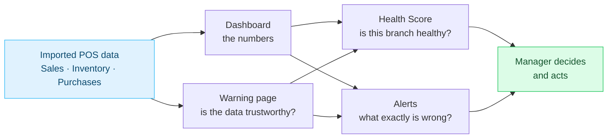
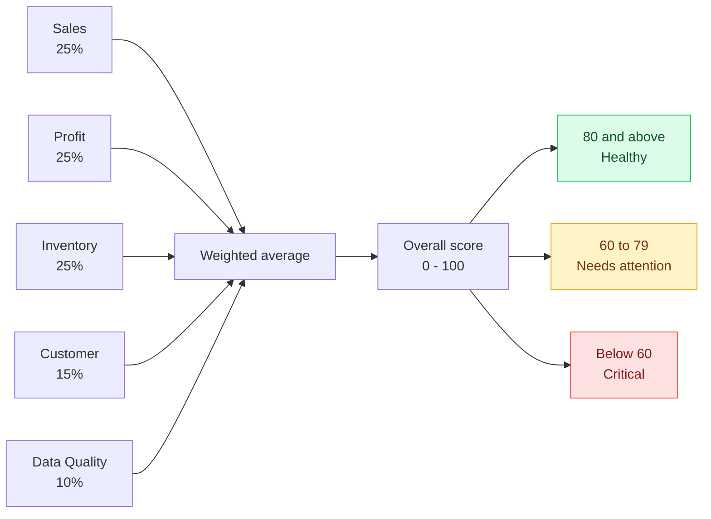
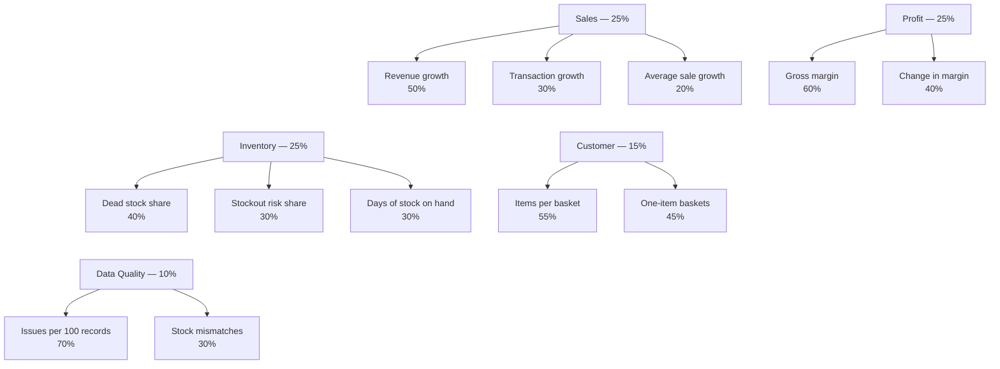
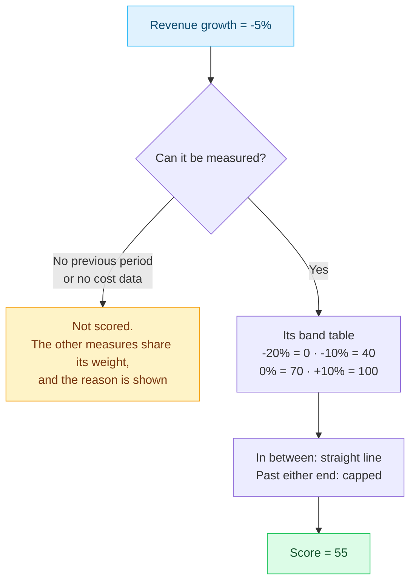
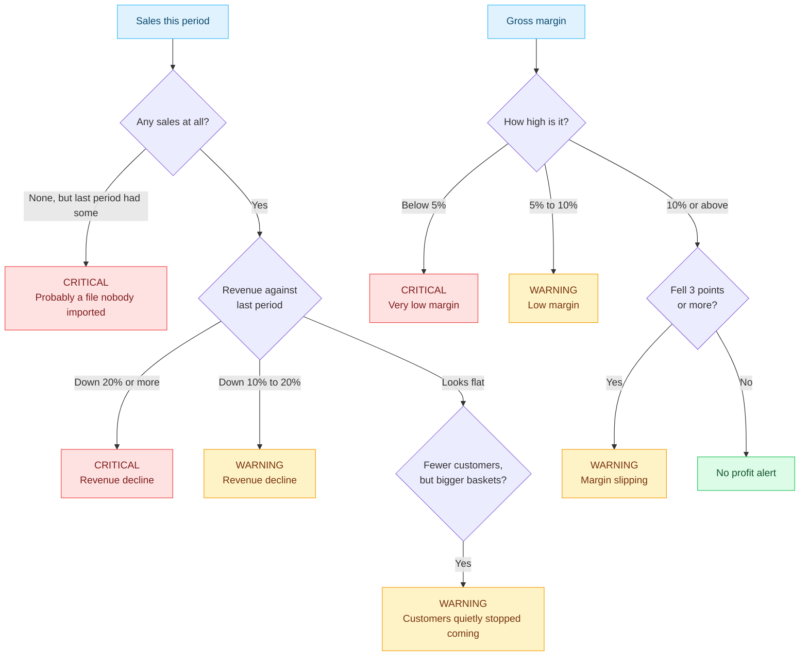
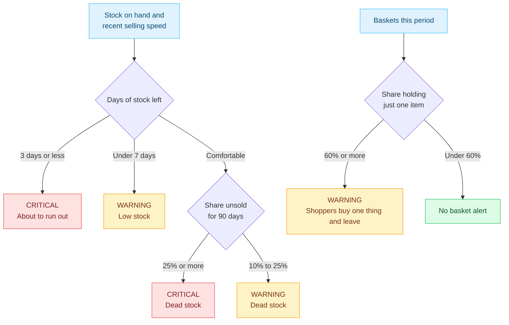
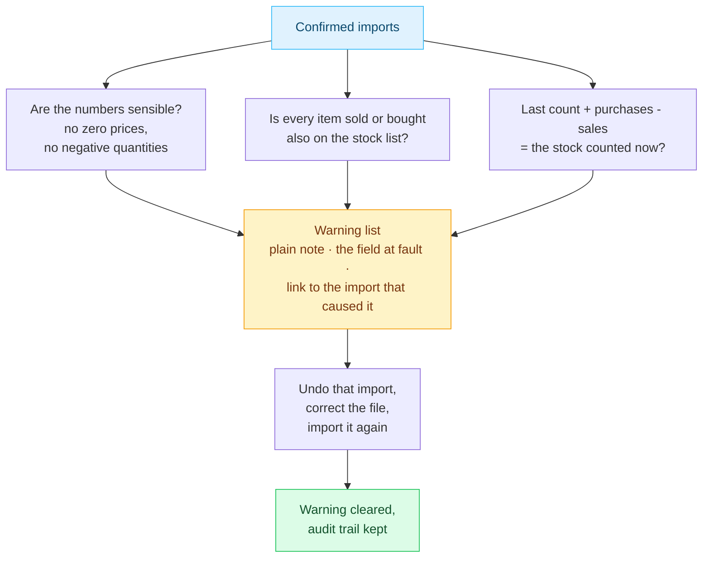
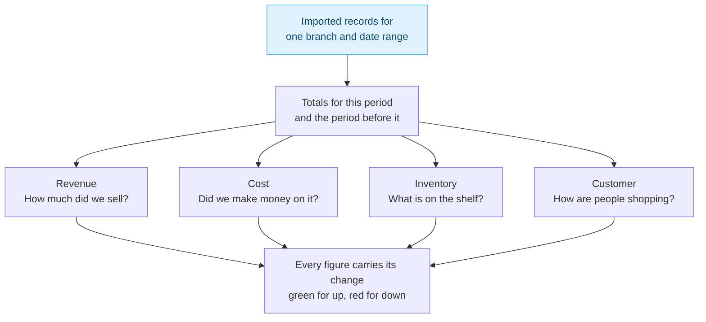

# BranchWise — calculation diagrams

Diagrams for explaining **how BranchWise works out its numbers** — the dashboard, the
Branch Health Score, the alerts, and the Warning page. They are written for a business
audience (a teacher, a manager, an assessor): every box names a business idea, not a
piece of code.

Eight diagrams, one topic each — enough to follow the whole story without a slide for
every rule.

## Turning these into images

```
npm run diagrams
```

That renders every `.mmd` file in this folder to a PNG (3x, for slides) and an SVG (for
Word or a poster) in `diagram/out/`. It uses `mermaid-cli`, installed by `npm install`
at the repo root, driving the copy of Google Chrome already on this machine
(`diagram/puppeteer-config.json` points at it — change that path if Chrome lives
somewhere else). Edit a `.mmd` file and run the command again to update its image.

Each `.mmd` starts with a shared styling line so all the diagrams look alike; red means
critical, amber means warning, green means fine, blue means data coming in.
`_style.txt` and `_classes.txt` hold that shared styling for when you add a new diagram —
they are not diagrams themselves.

## What each one shows

| # | File | Shows |
| --- | --- | --- |
| 01 | `01-big-picture` | The whole path from imported data to a decision. Use this one if you only have room for a single slide. |
| 02 | `02-health-score` | The five parts of the Health Score, what each is worth, and the healthy / needs-attention / critical bands. |
| 03 | `03-health-what-each-part-measures` | The measures inside each of those five parts, and their weights. |
| 04 | `04-value-to-score` | How one figure turns into a score out of 100 — and what happens when it cannot be measured at all. |
| 05 | `05-alerts-sales-and-profit` | The sales and profit alerts, as decision trees. |
| 06 | `06-alerts-stock-and-baskets` | The stock alerts (running out, not moving) and the shopping-behaviour alert. |
| 07 | `07-warning-checks` | The Warning page's checks, and how a warning gets fixed. |
| 08 | `08-dashboard` | How the four dashboard tabs are built from the same records, each compared with the period before. |

Suggested order for a short talk: **01 → 02 → 04 → 05 → 07**.

The thresholds and weights shown here are the shipped defaults; several can be tuned on
the admin Settings page. The full written descriptions live in `docs/branch_health.md`
and `docs/retail_dashboard.md`.

## BranchWise — from imported data to a decision



## Health Score — five parts make one score



## Health Score — what each part measures



## How one figure becomes a score out of 100



## Alerts about sales and profit



## Alerts about stock and shopping behaviour



## Warning page — checking the data can be trusted



## Dashboard — one branch, one date range, four questions



