# BranchWise — calculation diagrams

Diagrams for explaining **how BranchWise works out its numbers** — the dashboard, the
Branch Health Score, the alerts, and the Warning page. They are written for a business
audience (a teacher, a manager, an assessor): every box names a business idea, not a
piece of code.

Fifteen diagrams. The first eight tell the whole story, one topic each. Six more are
the alert **decision trees** — one per pillar, in full, for when someone asks "but how
does it decide?" and a summary slide is not enough. The last two are the one-slide
overview of Business Alerts, and one worked example to make it concrete.

## Turning these into images

```
npm run diagrams
```

That renders every `.mmd` file in this folder to a PNG (about 3,000 px wide, for slides)
and an SVG (for Word or a poster) in `diagram/out/`. The canvas is deliberately wide, so
a left-to-right tree keeps readable text instead of being squeezed. It uses `mermaid-cli`, installed by `npm install`
at the repo root, driving the copy of Google Chrome already on this machine
(`diagram/puppeteer-config.json` points at it — change that path if Chrome lives
somewhere else). Edit a `.mmd` file and run the command again to update its image.

Each `.mmd` starts with a shared styling line so all the diagrams look alike; red means
critical, amber means warning, grey-blue means a normal notice that asks for nothing,
green means fine or no alert, blue means data coming in, and purple diamonds are the
"why did this happen" question inside a tree.
`_style.txt` and `_classes.txt` hold that shared styling for when you add a new diagram —
they are not diagrams themselves.

## What each one shows

| # | File | Shows |
| --- | --- | --- |
| 01 | `01-big-picture` | The whole path from imported data to a decision. Use this one if you only have room for a single slide. |
| 02 | `02-health-score` | The five parts of the Health Score, what each is worth, and the healthy / needs-attention / critical bands. |
| 03 | `03-health-what-each-part-measures` | The measures inside each of those five parts, and their weights. |
| 04 | `04-value-to-score` | How one figure turns into a score out of 100 — and what happens when it cannot be measured at all. |
| 05 | `05-alerts-sales-and-profit` | The sales and profit alerts, as decision trees. |
| 06 | `06-alerts-stock-and-baskets` | The stock alerts (running out, not moving) and the shopping-behaviour alert. |
| 07 | `07-warning-checks` | The Warning page's checks, and how a warning gets fixed. |
| 08 | `08-dashboard` | How the four dashboard tabs are built from the same records, each compared with the period before. |
| 09 | `09-tree-sales-revenue` | **Sales pillar** — the revenue tree in full, including the empty-period case and the fewer-customers / smaller-basket split. |
| 10 | `10-tree-profit-margin` | **Profit pillar** — the margin tree: is it low, is it slipping, and why. |
| 11 | `11-tree-inventory-stock-running-out` | **Inventory pillar** — days of stock left, the three bands, and order-more versus order-sooner. |
| 12 | `12-tree-inventory-dead-stock` | **Inventory pillar** — stock that has not sold in 90 days, judged as a share. |
| 13 | `13-tree-customer-losing-customers` | **Customer pillar** — the hidden case: fewer shoppers behind a steady revenue line. |
| 14 | `14-tree-customer-single-item` | **Customer pillar** — sales that hold only one product, and whether that is new. |
| 15 | `15-business-alerts-overview` | Business Alerts on one slide: the four pillars, the limit check, and the three levels. |
| 16 | `16-example-revenue-alert` | One alert end to end with real figures: a branch's revenue fall, the level it earns, and the reason behind it. |

Suggested order for a short talk: **01 → 02 → 04 → 05 → 07**. If the audience wants the
detail of one pillar, follow with its tree from 09–14 rather than all six.

The written version of the same six trees, with a worked example for each, is
[`docs/business-alerts.md`](../docs/business-alerts.md).

The thresholds and weights shown here are the shipped defaults; several can be tuned on
the admin Settings page. The full written descriptions live in `docs/branch_health.md`
and `docs/retail_dashboard.md`.

## BranchWise — from imported data to a decision

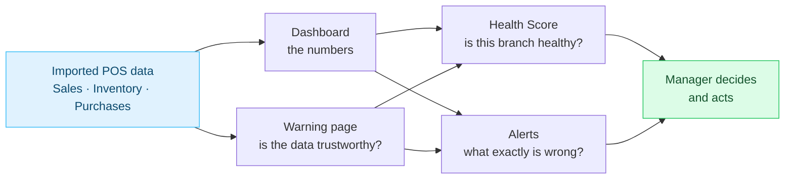

## Health Score — five parts make one score

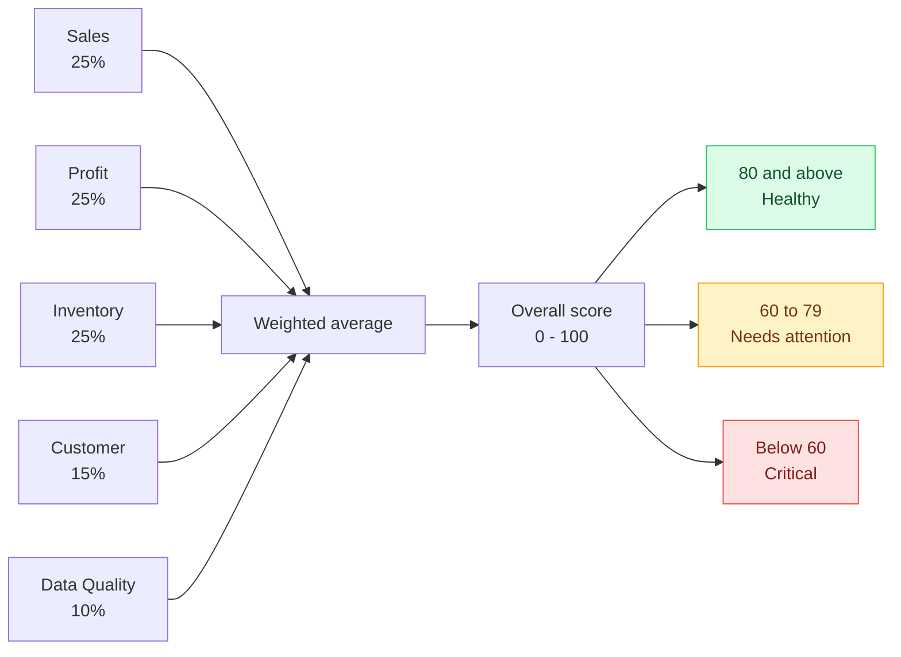

## Health Score — what each part measures

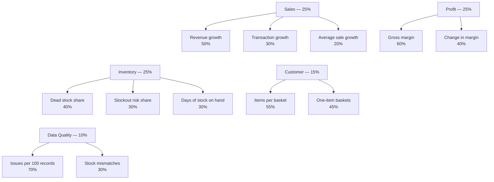

## How one figure becomes a score out of 100

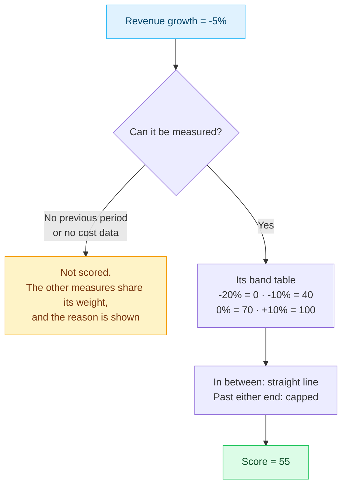

## Alerts about sales and profit

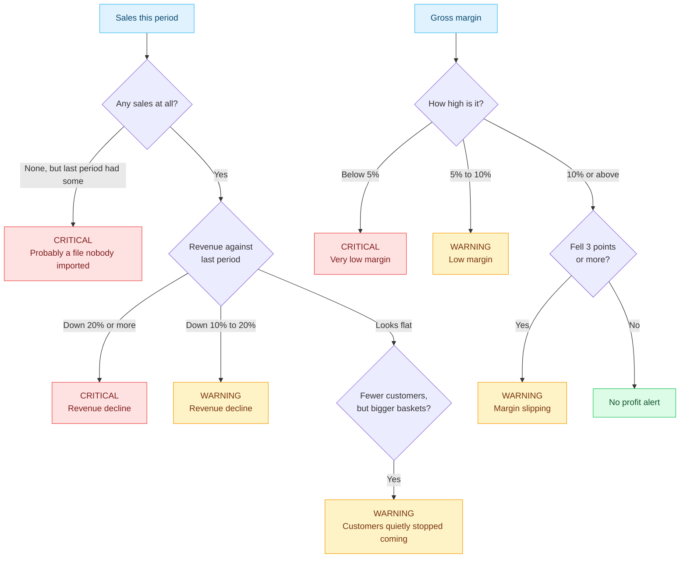

## Alerts about stock and shopping behaviour

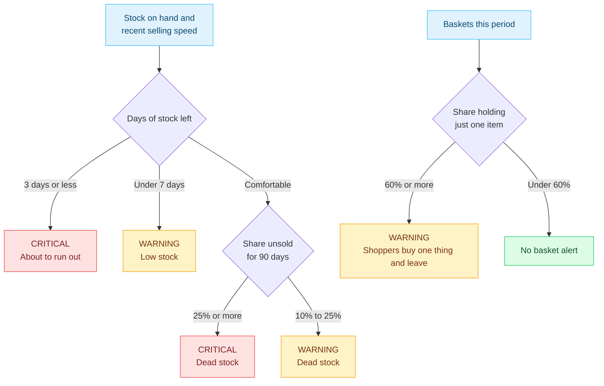

## Warning page — checking the data can be trusted

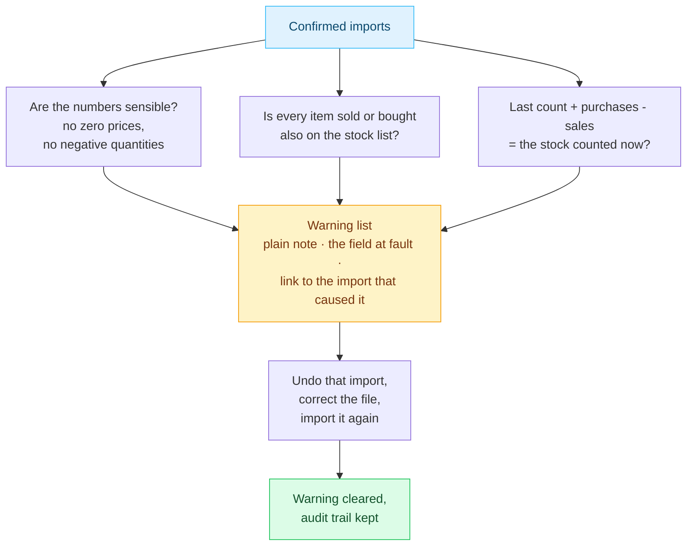

## Dashboard — one branch, one date range, four questions

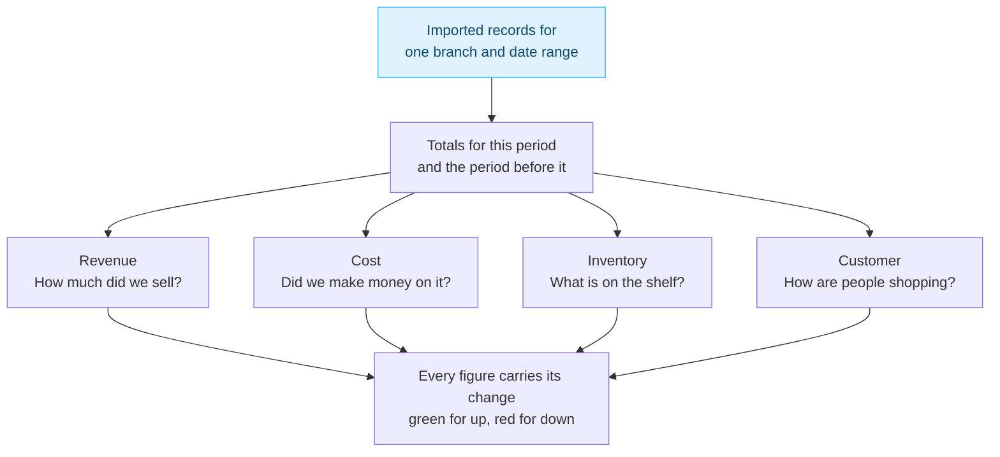

## Decision tree — Sales pillar: revenue

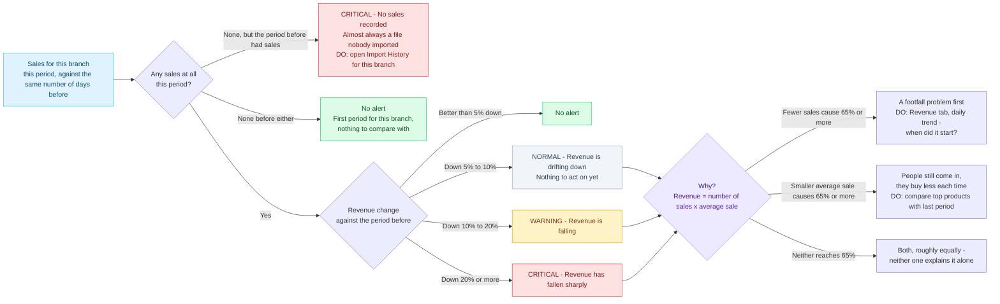

## Decision tree — Profit pillar: margin

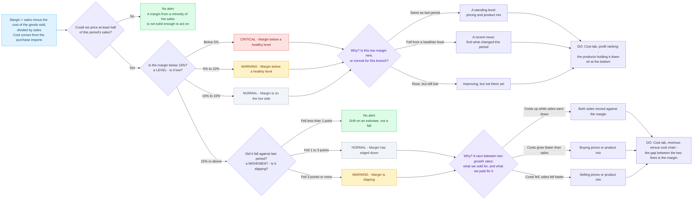

## Decision tree — Inventory pillar: stock running out

```mermaid
%%{init: {"theme":"base","themeVariables":{"fontFamily":"Helvetica, Arial, sans-serif","fontSize":"15px","primaryColor":"#eef2ff","primaryTextColor":"#1e293b","primaryBorderColor":"#a5b4fc","lineColor":"#94a3b8","clusterBkg":"#f8fafc","clusterBorder":"#cbd5e1"},"flowchart":{"curve":"basis","nodeSpacing":28,"rankSpacing":42,"padding":8,"useMaxWidth":true}}%%
flowchart LR
    A["Every product on the newest stock count"]:::data
    A --> Q1{"Did it sell at all<br/>in the last 30 days?"}
    Q1 -- "No" --> X["Not counted here - no selling rate,<br/>so no days left.<br/>It goes to the dead-stock check"]:::data
    Q1 -- "Yes" --> D["Days left = stock on hand<br/>divided by units sold per day"]
    D --> Q2{"The branch alert is the worst band<br/>that has anything in it"}
    Q2 -- "3 days or less" --> C1["CRITICAL - Products about to run out"]:::crit
    Q2 -- "4 to 7 days" --> W1["WARNING - Stock is running low"]:::warn
    Q2 -- "8 to 14 days" --> N1["NORMAL - Stock worth keeping an eye on"]:::norm
    Q2 -- "More than 14 days" --> Z1["No alert"]:::good
    C1 --> WHY{"Why are they running out?<br/>Each one's last 30 days against<br/>its own earlier rate"}:::why
    W1 --> WHY
    N1 --> WHY
    WHY -- "Most selling 1.3x faster or more" --> R1["Demand grew:<br/>ORDER MORE, not just sooner"]
    WHY -- "Most at their usual rate" --> R2["Stock was left to run down:<br/>ORDER SOONER"]
    WHY -- "A mix of both" --> R3["Check the quantities<br/>product by product"]
    R1 --> DO["DO: Inventory tab, low-stock table -<br/>sorted by days left, so what to<br/>reorder first is at the top"]
    R2 --> DO
    R3 --> DO
    classDef crit fill:#fee2e2,stroke:#ef4444,color:#7f1d1d
    classDef warn fill:#fef3c7,stroke:#f59e0b,color:#78350f
    classDef good fill:#dcfce7,stroke:#22c55e,color:#14532d
    classDef data fill:#e0f2fe,stroke:#38bdf8,color:#0c4a6e
    classDef norm fill:#f1f5f9,stroke:#94a3b8,color:#334155
    classDef why fill:#ede9fe,stroke:#a78bfa,color:#4c1d95
```

## Decision tree — Inventory pillar: dead stock

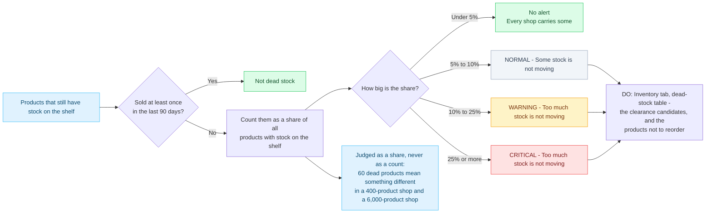

## Decision tree — Customer pillar: losing customers

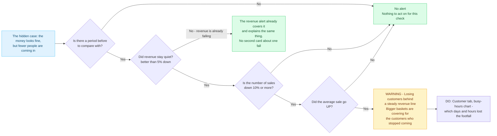

## Decision tree — Customer pillar: single-item sales

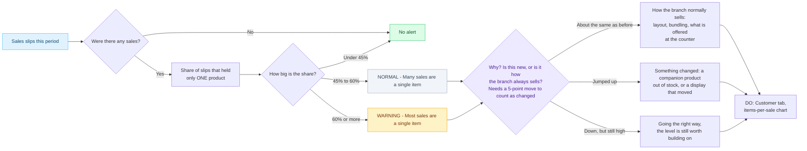

## Business Alerts — the whole thing on one slide

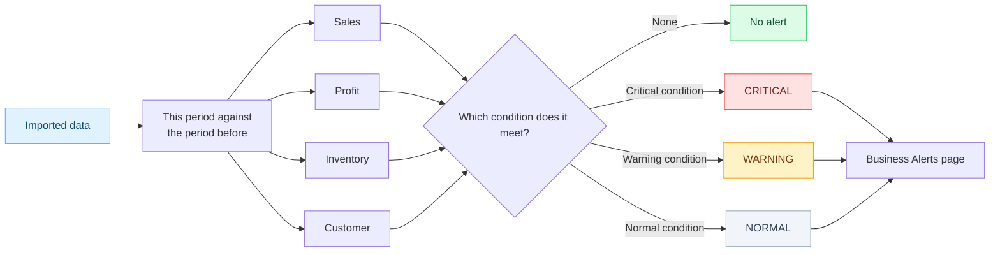

## One alert, end to end — a worked example

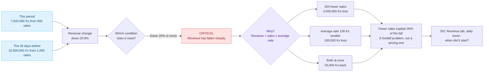
